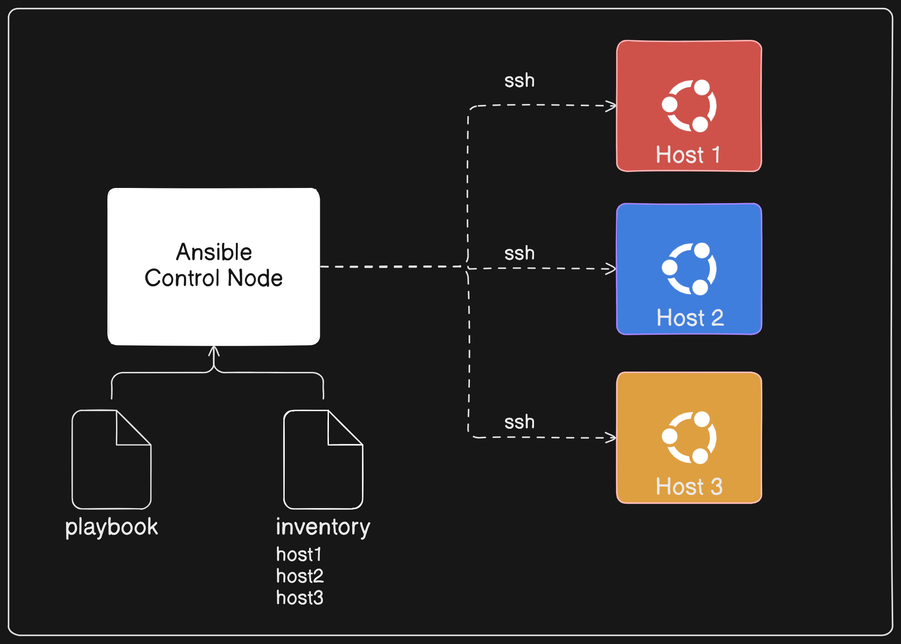
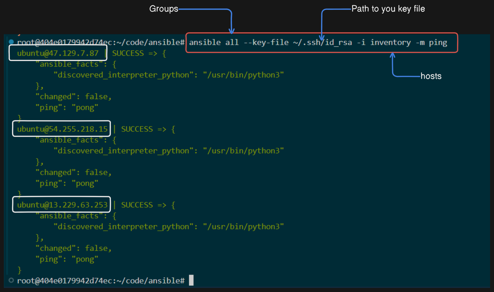
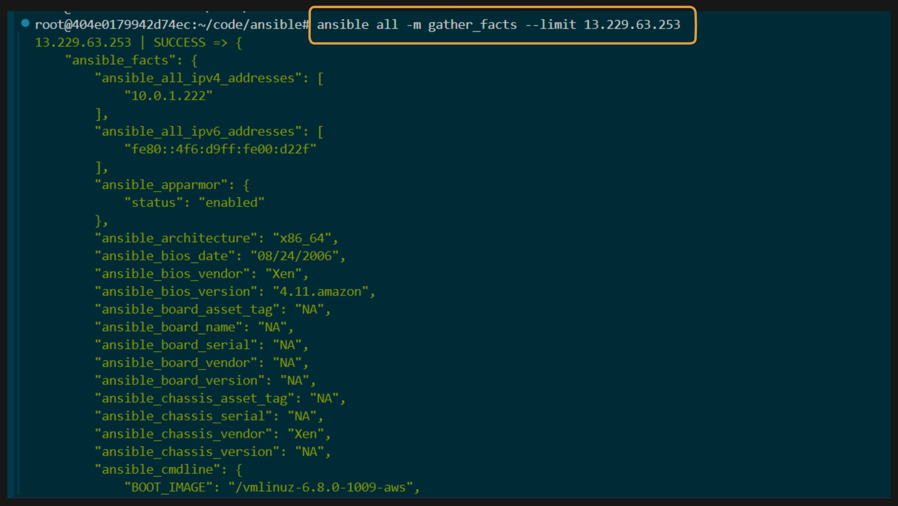

# Getting Started with Ansible: Setup and Running Ad-hoc Commands

In this lab, we will be introduced to an automation tool called `Ansible`. So, what is Ansible? It is an open-source automation tool used for configuration management, application deployment, and task automation. Ansible helps manage multiple machines by selecting portions of Ansible's `inventory`, which is stored in simple plain text files.

## How Ansible Works

Ansible works by connecting to nodes and pushing out small programs called "Ansible modules," which it executes over `SSH` before removing them. The primary language for these modules is Python, though any language that can return JSON can be used.



1. **Control Node**: The machine where Ansible is installed and runs, executing playbooks written in YAML. No agents are needed on remote hosts, making Ansible scalable and efficient.

2. **Managed Nodes**: Servers, systems, or devices managed by Ansible. These are accessed over SSH for Linux/Unix systems, requiring no agent installation.

3. **Inventory**: A file that lists the nodes managed by Ansible. It can be a simple text file, a dynamic inventory script, or sourced from a cloud service.

4. **Playbooks**: YAML scripts that describe automation tasks, desired states of systems, and the sequence of task execution. They can include variables, templates, and control structures for complex automation.

## Getting Started with Ansible (Installation)

To install Ansible on an Ubuntu machine, run these commands:

```sh
sudo apt-get update -y
sudo apt install software-properties-common -y
sudo apt-add-repository --yes --update ppa:ansible/ansible
sudo apt-get install -y ansible
```

Check the Ansible version to verify the installation:


## Setup Ansible on the Control Node

1. Create a directory, e.g., `ansible`.

2. Create a file named `inventory` to store the remote hosts and add the IP addresses or hostnames:

    ```ini
    ubuntu@<remote_host_1_IP>
    ubuntu@<remote_host_2_IP>
    ubuntu@<remote_host_3_IP>
    ```

3. To check the connection, run this command to `ping` the remote hosts:

    ```sh
    ansible all --key-file <your_key_file> -i inventory -m ping
    ```
    

    This command confirms the successful connection between the control node and the remote servers. Make sure, you can ssh into the remote servers using `your_key_file`

## Create Ansible Configuration File for a More Organized Setup

1. Create a file named `ansible.cfg` and add this content:

    ```ini
    [defaults]
    inventory = inventory
    remote_user = ubuntu
    private_key_file = ~/.ssh/id_rsa
    host_key_checking = False
    ```

    Replace `remote_user` and `private_key_file` with your desired values.

2. Update the `inventory` file:

    ```ini
    <remote_host_1_IP>
    <remote_host_2_IP>
    <remote_host_3_IP>
    ```

3. Run the ping command to ping all hosts:

    ```sh
    ansible all -m ping
    ```
    

## Running Ad-hoc Commands

Ad-hoc commands in Ansible are `one-time`, immediate commands used to perform quick tasks on remote nodes without writing a playbook. These commands are executed directly from the command line and are useful for simple, quick actions such as rebooting servers, managing packages, or retrieving information from nodes.

**Syntax**

The basic syntax for an Ansible ad-hoc command is:

```sh
ansible <host-pattern> -i <inventory> -m <module> -a "<module-arguments>"
```

**Components:**

- `<host-pattern>`: Specifies which hosts in the inventory to target (e.g., all, webservers, dbservers).
- `-i <inventory>`: Specifies the path to the inventory file.
- `-m <module>`: Specifies the module to use (e.g., ping, shell, apt, yum, service).
- `-a "<module-arguments>"`: Provides arguments for the module.

**Examples:**

- To list all the hosts:

    ```sh
    ansible all --list-hosts
    ```

    

- To gather facts about the hosts:

    ```sh
    ansible all -m gather_facts --limit <remote_server_ip>
    ```
    

## Running Elevated Ad-hoc Commands

Elevated ad-hoc commands in Ansible refer to commands executed on remote nodes with elevated (superuser or root) privileges. This is necessary for tasks that require administrative rights, such as installing software, updating system configurations, or modifying system files.

In Ansible, you can run ad-hoc commands with elevated privileges by using the `--become` flag. The `--become` flag tells Ansible to switch to another user (by default, the `root` user) to execute the command.

**Example**

1. An elevated ad-hoc command to update the package index on a remote server:

    ```bash
    ansible all -m apt -a "update_cache=yes" --become
    ```

    In this command:

    - `all`: Refers to all hosts in the inventory file.
    - `-m apt`: Uses the apt module (for Debian-based systems).
    - `-a "update_cache=yes"`: Passes arguments to the module, in this case, to update the package cache.
    - `--become`: Elevates the command to run with superuser privileges.

2. Installing packages

    - To install a package like `vim-nox`:

    ```sh
    ansible all -m apt -a name=vim-nox --become
    ```

    

    - You can also check on the remote hosts if the installation is done correctly:

    

3. Upgrade the distribution

    ```sh
    ansible all -m apt -a "upgrade=dist" --become
    ```

    

---

We have installed `Ansible` and set up our basic Ansible environment with a `control node` and `3 remote hosts`. We have also tested our setup by sending ping requests to the remote servers and running some ad-hoc commands. In the next lab, we will be introduced to `playbooks` and perform tasks by running them.