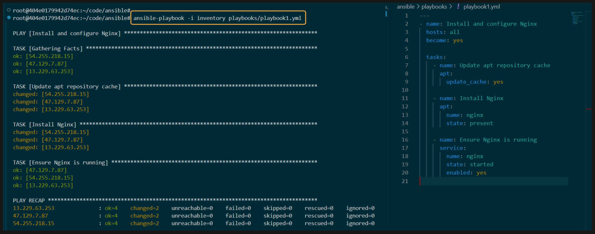
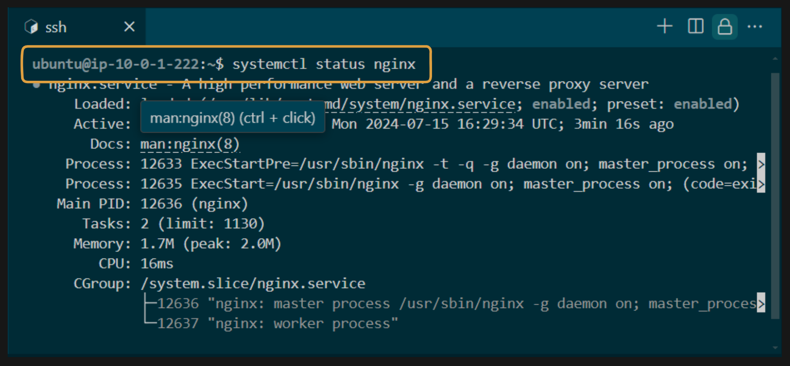

# Installing Nginx Using Ansible

In this guide, we will walk through the process of installing Nginx on a remote server using Ansible. `Nginx` is a high-performance web server and reverse proxy that is widely used for serving static content, load balancing, and handling HTTP and HTTPS traffic.


## Prerequisites

1. **Ansible Installed on Control Node**: Ensure that Ansible is installed on your control node.
2. **Inventory File**: Create an inventory file that lists the remote servers where Nginx will be installed.
3. **SSH Access**: Ensure that the control node can SSH into the remote servers using a key pair.

## Step 1: Create an Inventory File

Create a directory for your Ansible project and navigate into it. Then create an inventory file to define the remote hosts:

```sh
mkdir ansible
cd ansible
```

## Step 2: Create inventory file

Add the IP addresses or hostnames of your remote servers in the `inventory` file:

```ini
[webservers]
<remote_server_1_IP>
<remote_server_2_IP>
<remote_server_3_IP>
```

## Step 2: Create an Ansible Playbook

Create a playbook file named `install_nginx.yml`:

```sh
nano install_nginx.yml
```

Add the following content to the playbook file:

```yaml
---
- name: Install Nginx on web servers
  hosts: webservers
  become: true

  tasks:
    - name: Update apt repository cache
      apt:
        update_cache: yes

    - name: Install Nginx
      apt:
        name: nginx
        state: present

    - name: Ensure Nginx is running
      service:
        name: nginx
        state: started
        enabled: yes
```

### Explanation

- `name`: A description of the playbook or task.
- `hosts`: Specifies the group of hosts from the inventory file.
- `become`: Enables privilege escalation to run tasks with superuser privileges.
- `tasks`: A list of tasks to be executed on the remote hosts.
  - `Update apt repository cache`: Updates the package index on the remote server.
  - `Install Nginx`: Installs the Nginx package.
  - `Ensure Nginx is running`: Ensures that the Nginx service is started and enabled to start at boot.

## Step 3: Create an Ansible Configuration File

Create an `ansible.cfg` file to define configuration settings for your Ansible environment:

```sh
nano ansible.cfg
```

Add the following content to the configuration file:

```ini
[defaults]
inventory = inventory
remote_user = ubuntu
private_key_file = ~/.ssh/id_rsa
host_key_checking = False
```

### Explanation

- `inventory`: Specifies the path to the inventory file.
- `remote_user`: The username for SSH connections.
- `private_key_file`: The path to the SSH private key file.
- `host_key_checking`: Disables host key checking for convenience.

## Step 4: Run the Playbook

Before running the playbook you can check if ansible can ssh into the remote servers. We can simply run this command to ping all the hosts:

```sh
ansible all -m ping
```
If you get a response like this, then you are good to go:


Run the playbook using the following command:

```sh
ansible-playbook -i inventroy <path_to_your_playbook>/install_nginx.yml
```



This command will execute the tasks defined in the `install_nginx.yml` playbook on the remote servers listed in the inventory file.

## Step 5: Verify Nginx Installation

After the playbook has run successfully, verify that Nginx is installed and running on the remote servers. 

- Check the status of the nginx

    ```sh
    systemctl status nginx
    ```
    
    

    You can also verify from the other hosts also by ssh into that server.

- You can do this by accessing the server's IP address in a web browser or by using the `curl` command:

    ```sh
    curl http://<remote_server_1_IP>
    curl http://<remote_server_2_IP>
    curl http://<remote_server_3_IP>
    ```

You should see the default Nginx welcome page, indicating that Nginx is running correctly.
You can also visit the browser if you can access the server publicly.


## Conclusion

In this guide, we have learned how to install Nginx on remote servers using Ansible. We created an inventory file to define the remote hosts, wrote a playbook to install and start Nginx, configured Ansible settings, and ran the playbook to complete the installation. This approach allows for efficient and repeatable deployment of software across multiple servers.