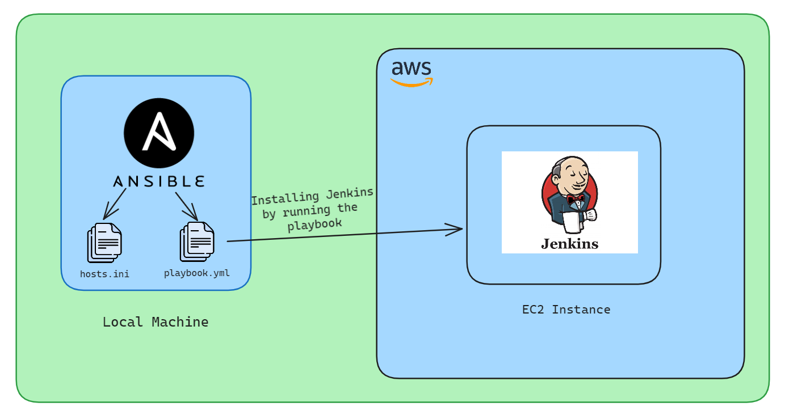
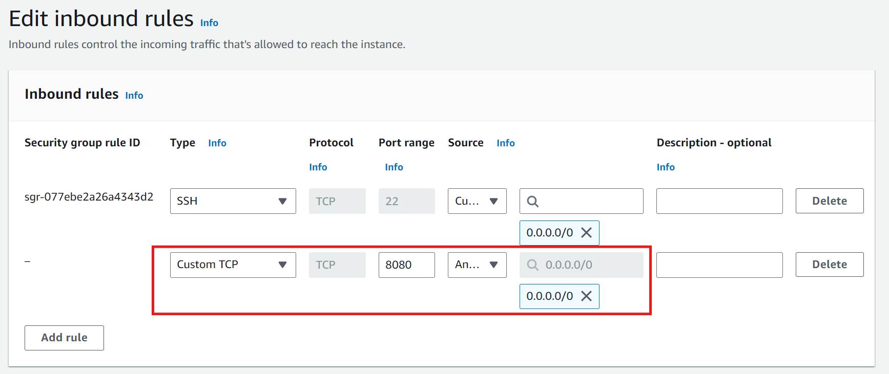
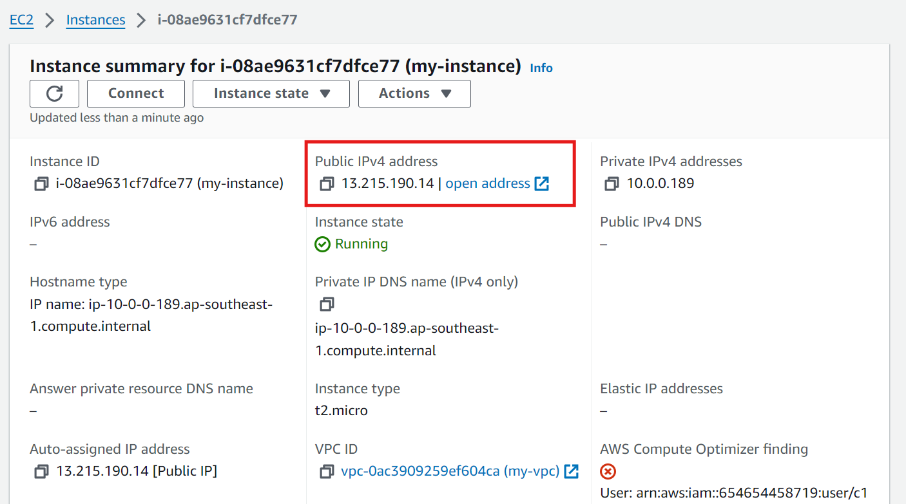
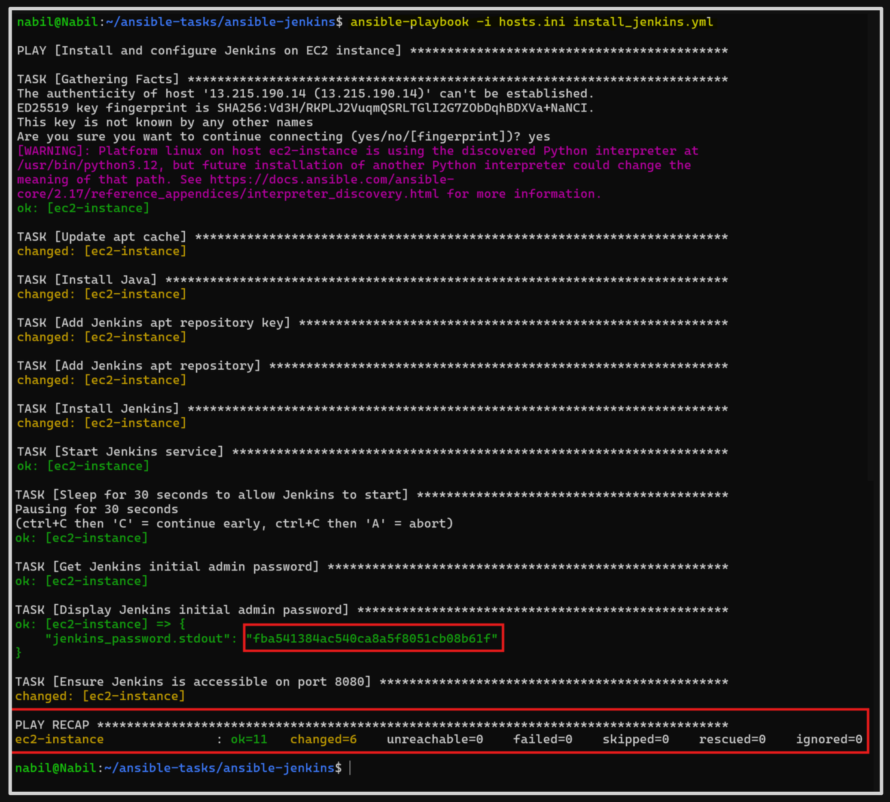
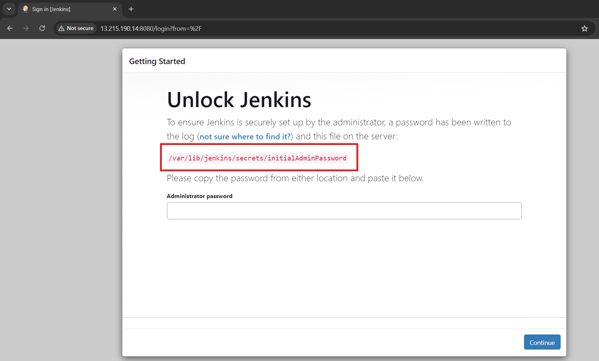
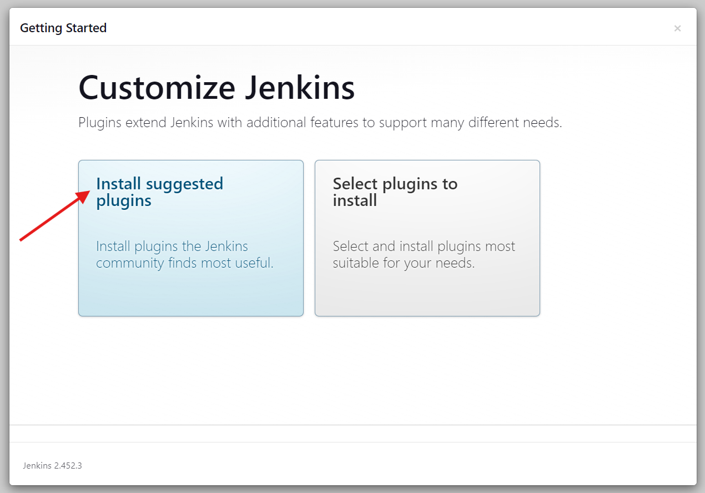
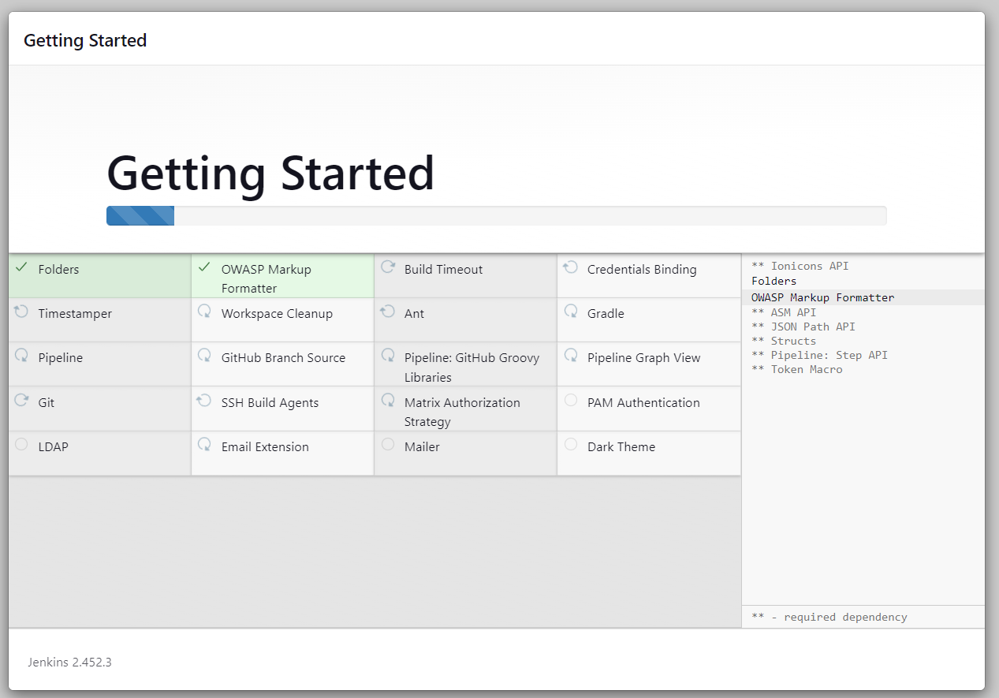

# Installing Jenkins on an EC2 Instance Using Ansible Playbook

## Overview

This guide provides step-by-step instructions for installing and configuring Jenkins on an Amazon EC2 instance using Ansible. The process involves setting up an EC2 instance, installing Ansible on your local machine, creating an Ansible playbook, executing it to install and configure Jenkins, and verifying the installation.



## Prerequisites

1. **EC2 Instance:**
   - An Ubuntu-based EC2 instance running on AWS.
   - Security group allowing inbound SSH traffic (port 22) from your IP address and HTTP traffic (port 8080) from anywhere.

2. **Local Machine:**
   - Ansible installed on your local machine.
   - SSH access to the EC2 instance using a key pair.
   - Python installed.

## Steps

### Step 1: Set up Your EC2 Instance

Ensure you have an EC2 instance running and accessible via SSH. Configure the security group to allow inbound traffic on ports 22 (SSH) and 8080 (Jenkins).



### Step 2: Install Ansible

If Ansible is not already installed on your local machine, install it using:

```bash
sudo apt update
sudo apt install ansible
```

Verify the installation:

```bash
ansible --version
```

### Step 3: Create an Ansible Playbook

Create a directory for your Ansible project:

```bash
mkdir ansible-jenkins
cd ansible-jenkins
```

Create an inventory file named `hosts.ini`:

```ini
[jenkins_servers]
ec2-instance ansible_host=<EC2_PUBLIC_IP> ansible_user=ubuntu ansible_ssh_private_key_file=/path/to/your-key.pem
```

Replace `<EC2_PUBLIC_IP>` with your EC2 instance's public IP address and adjust the path to your SSH key.



Find the path of your key-pair file:


Create a playbook file named `install_jenkins.yml`:

```yaml
---
- name: Install and configure Jenkins on EC2 instance
  hosts: jenkins_servers
  become: yes

  tasks:
    - name: Update apt cache
      apt:
        update_cache: yes

    - name: Install Java
      apt:
        name: openjdk-11-jdk
        state: present

    - name: Add Jenkins apt repository key
      apt_key:
        url: https://pkg.jenkins.io/debian-stable/jenkins.io-2023.key
        state: present

    - name: Add Jenkins apt repository
      apt_repository:
        repo: deb https://pkg.jenkins.io/debian-stable binary/
        state: present

    - name: Install Jenkins
      apt:
        name: jenkins
        state: present

    - name: Start Jenkins service
      service:
        name: jenkins
        state: started
        enabled: yes

    - name: Sleep for 30 seconds to allow Jenkins to start
      pause:
        seconds: 30

    - name: Get Jenkins initial admin password
      command: cat /var/lib/jenkins/secrets/initialAdminPassword
      register: jenkins_password
      changed_when: false

    - name: Display Jenkins initial admin password
      debug:
        var: jenkins_password.stdout

    - name: Ensure Jenkins is accessible on port 8080
      ufw:
        rule: allow
        port: '8080'
```

## Description of the Playbook

This Ansible playbook is designed to install and configure Jenkins on an EC2 instance. Here's a breakdown of what each task does:

1. **Update apt cache:** Refreshes the package lists on the target system.

2. **Install Java:** Installs OpenJDK 11, which is required for Jenkins.

3. **Add Jenkins apt repository key:** Adds the GPG key for the Jenkins repository to ensure package authenticity.

4. **Add Jenkins apt repository:** Adds the official Jenkins repository to the system's package sources.

5. **Install Jenkins:** Installs the Jenkins package from the added repository.

6. **Start Jenkins service:** Starts the Jenkins service and enables it to start on system boot.

7. **Sleep for 30 seconds:** Pauses the playbook execution to allow Jenkins time to start up fully.

8. **Get Jenkins initial admin password:** Retrieves the initial admin password from the Jenkins installation.

9. **Display Jenkins initial admin password:** Outputs the retrieved password for the user to see.

10. **Ensure Jenkins is accessible on port 8080:** Configures the firewall (ufw) to allow incoming traffic on port 8080, which is the default port for Jenkins.

This playbook automates the entire process of setting up Jenkins, from installing dependencies to configuring access, making it easier to deploy Jenkins consistently across EC2 instances.

### Step 4: Run the Ansible Playbook

Ensure your SSH key has the correct permissions:

```bash
chmod 600 /path/to/your-key.pem
```

Run the playbook:

```bash
ansible-playbook -i hosts.ini install_jenkins.yml
```

This command will connect to your EC2 instance and perform the steps defined in the playbook to install and configure Jenkins.



### Step 5: Verify the Installation

1. **Connect to the EC2 instance:**

   ```bash
   ssh -i /path/to/your-key.pem ubuntu@<EC2_PUBLIC_IP>
   ```

2. **Verify Jenkins is running:**

   Check the status of the Jenkins service:

   ```bash
   sudo systemctl status jenkins
   ```

   The output should indicate that Jenkins is active and running.

   

3. **Access Jenkins web interface:**

   Open a web browser and navigate to:

   ```
   http://<EC2_PUBLIC_IP>:8080
   ```

   You should see the Jenkins setup wizard.

   

4. **Complete Jenkins setup:**

   - Use the initial admin password displayed in the Ansible playbook output to unlock Jenkins.
    

   - Follow the setup wizard to install suggested plugins and create an admin user.

    

    

## Conclusion

By following these steps, you will successfully install and configure Jenkins on your EC2 instance using Ansible. This process automates the setup of Jenkins, making it easier to deploy and manage your continuous integration and continuous delivery (CI/CD) environment on AWS.