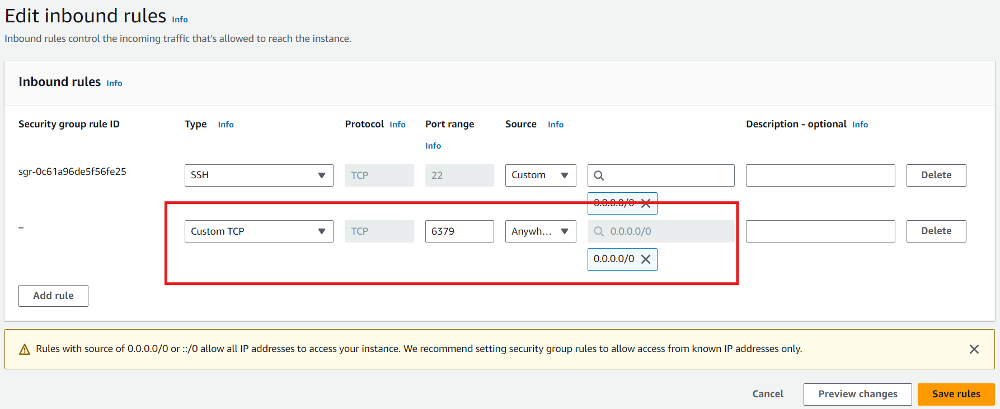
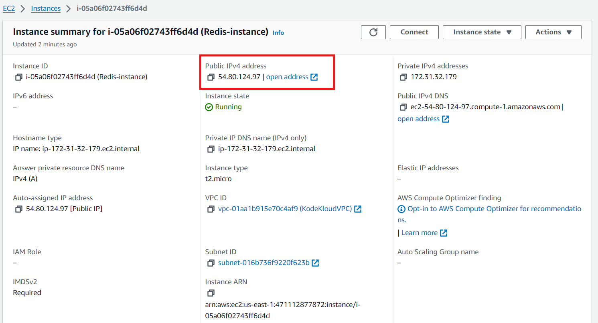
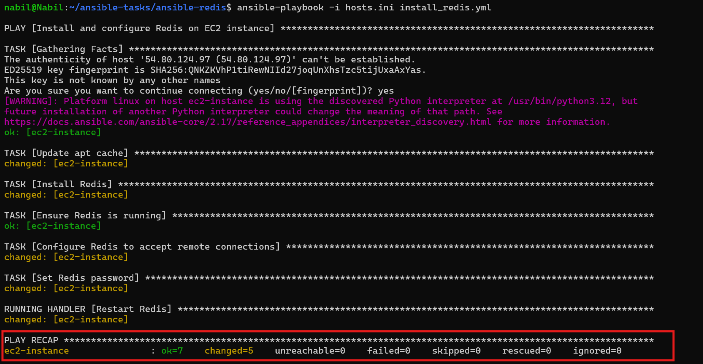
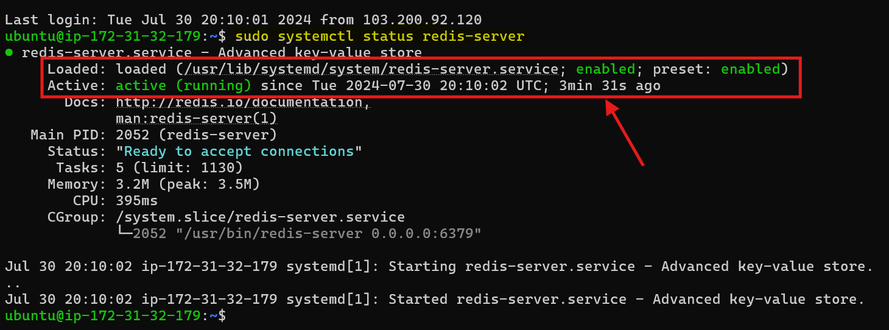

# Installing Redis on an EC2 Instance Using Ansible Playbook

## Overview

This guide provides step-by-step instructions for installing and configuring Redis on an Amazon EC2 instance using Ansible. The process involves setting up an EC2 instance, installing Ansible on your local machine, creating an Ansible playbook, executing it to install and configure Redis, and verifying the installation.


## Prerequisites

1. **EC2 Instance:**
   - An Ubuntu-based EC2 instance running on AWS.
   - Security group allowing inbound SSH traffic (port 22) from your IP address and Redis traffic (port 6379) from necessary sources.

2. **Local Machine:**
   - Ansible installed on your local machine.
   - SSH access to the EC2 instance using a key pair.
   - Python installed.

## Steps

### Step 1: Set up Your EC2 Instance

Ensure you have an EC2 instance running and accessible via SSH. Configure the security group to allow inbound traffic on ports 22 (SSH) and 6379 (Redis).



### Step 2: Install Ansible

If Ansible is not already installed on your local machine, install it using:

```bash
sudo apt update
sudo apt install ansible
```

Verify the installation:

```bash
ansible --version
```

### Step 3: Create an Ansible Playbook

Create a directory for your Ansible project:

```bash
mkdir ansible-redis
cd ansible-redis
```

Create an inventory file named `hosts.ini`:

```ini
[redis_servers]
ec2-instance ansible_host=<EC2_PUBLIC_IP> ansible_user=ubuntu ansible_ssh_private_key_file=/path/to/your-key.pem
```

Replace `<EC2_PUBLIC_IP>` with your EC2 instance's public IP address and adjust the path to your SSH key.



Find the path of your key-pair file:


Create a playbook file named `install_redis.yml`:

```yaml
---
- name: Install and configure Redis on EC2 instance
  hosts: redis_servers
  become: yes

  tasks:
    - name: Update apt cache
      apt:
        update_cache: yes

    - name: Install Redis
      apt:
        name: redis-server
        state: present

    - name: Ensure Redis is running
      service:
        name: redis-server
        state: started
        enabled: yes

    - name: Configure Redis to accept remote connections
      lineinfile:
        path: /etc/redis/redis.conf
        regexp: '^bind 127\.0\.0\.1'
        line: 'bind 0.0.0.0'
      notify: Restart Redis

    - name: Set Redis password
      lineinfile:
        path: /etc/redis/redis.conf
        regexp: '^# requirepass foobared'
        line: 'requirepass your_strong_password'
      notify: Restart Redis

  handlers:
    - name: Restart Redis
      service:
        name: redis-server
        state: restarted
```

Replace `your_strong_password` with a secure password of your choice.

## Description of the Playbook

This Ansible playbook installs and configures Redis on an EC2 instance. Here's a breakdown of what each task does:

1. **Update apt cache:** Refreshes the package lists on the target system.

2. **Install Redis:** Installs the Redis server package.

3. **Ensure Redis is running:** Starts the Redis service and enables it to start on system boot.

4. **Configure Redis to accept remote connections:** Modifies the Redis configuration to allow connections from any IP address, not just localhost.

5. **Set Redis password:** Configures a password for Redis to enhance security.

The playbook also includes a handler to restart Redis when configuration changes are made.

### Step 4: Run the Ansible Playbook

Ensure your SSH key has the correct permissions:

```bash
chmod 600 /path/to/your-key.pem
```

Run the playbook:

```bash
ansible-playbook -i hosts.ini install_redis.yml
```

This command will connect to your EC2 instance and perform the steps defined in the playbook to install and configure Redis.



### Step 5: Verify the Installation

1. **Connect to the EC2 instance:**

   ```bash
   ssh -i /path/to/your-key.pem ubuntu@<EC2_PUBLIC_IP>
   ```

2. **Verify Redis is running:**

   Check the status of the Redis service:

   ```bash
   sudo systemctl status redis-server
   ```

   The output should indicate that Redis is active and running.

   

3. **Test Redis connection:**

   Connect to Redis using the redis-cli:

   ```bash
   redis-cli
   ```

   Once connected, authenticate and test:

   ```
   AUTH your_strong_password
   SET test_key "Hello, Redis!"
   GET test_key
   ```

   Replace `your_strong_password` with the password you set earlier.

   You should see the value you set being returned.

   

## Conclusion

By following these steps, you will successfully install and configure Redis on your EC2 instance using Ansible. This process automates the setup of Redis, making it easier to deploy and manage your in-memory data structure store on AWS.
