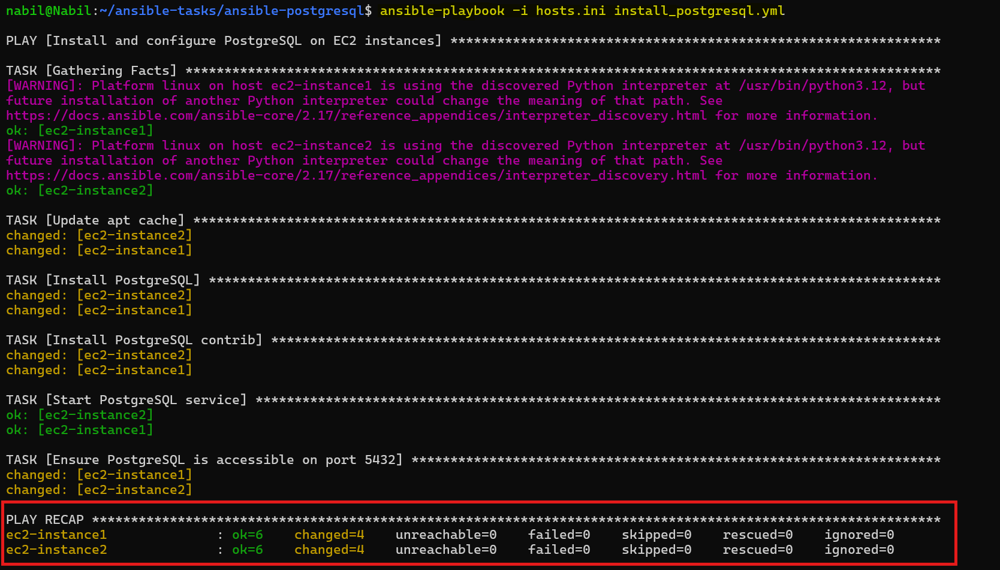
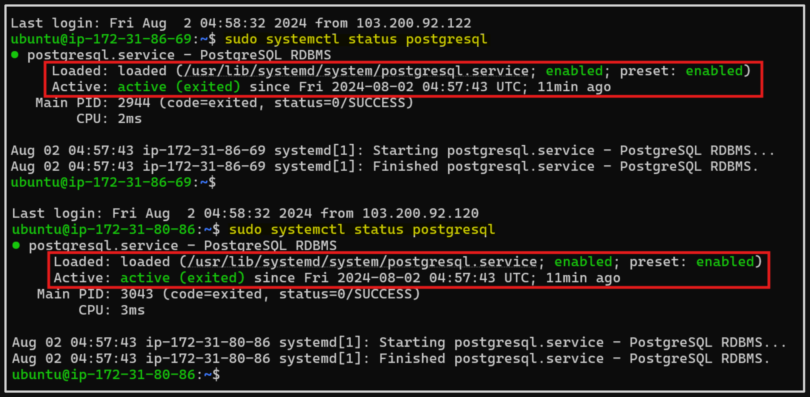

# Installing and Configuring PostgreSQL on Multiple EC2 Instances Using Ansible Playbook

## Overview

This guide provides step-by-step instructions for installing and configuring PostgreSQL on multiple Amazon EC2 instances using Ansible. The process involves setting up EC2 instances, installing Ansible on your local machine, creating an Ansible playbook, executing it to install and configure PostgreSQL, and verifying the installation.


## Prerequisites

1. **EC2 Instances:**
   - Ubuntu-based EC2 instances running on AWS.
   - Security groups allowing inbound SSH traffic (port 22) from your IP address and PostgreSQL traffic (port 5432) from specific IP addresses or anywhere (based on your security requirements).

2. **Local Machine:**
   - Ansible installed on your local machine.
   - SSH access to the EC2 instances using a key pair.
   - Python installed.

## Steps

### Step 1: Set up Your EC2 Instances

Ensure you have multiple EC2 instances running and accessible via SSH. Configure the security groups to allow inbound traffic on ports 22 (SSH) and 5432 (PostgreSQL).


### Step 2: Install Ansible

If Ansible is not already installed on your local machine, install it using:

```bash
sudo apt update
sudo apt install ansible
```

Verify the installation:

```bash
ansible --version
```

### Step 3: Create an Ansible Playbook

Create a directory for your Ansible project:

```bash
mkdir ansible-postgresql
cd ansible-postgresql
```

Create an inventory file named `hosts.ini`:

```ini
[postgresql_servers]
ec2-instance1 ansible_host=<EC2_PUBLIC_IP_1> ansible_user=ubuntu ansible_ssh_private_key_file=/path/to/your-key.pem
ec2-instance2 ansible_host=<EC2_PUBLIC_IP_2> ansible_user=ubuntu ansible_ssh_private_key_file=/path/to/your-key.pem
```

Replace `<EC2_PUBLIC_IP_1>` and `<EC2_PUBLIC_IP_2>` with your EC2 instances' public IP addresses and adjust the path to your SSH key.


Find the path of your key-pair file:


Create a playbook file named `install_postgresql.yml`:

```yaml
---
- name: Install and configure PostgreSQL on EC2 instances
  hosts: postgresql_servers
  become: yes

  tasks:
    - name: Update apt cache
      apt:
        update_cache: yes

    - name: Install PostgreSQL
      apt:
        name: postgresql
        state: present

    - name: Install PostgreSQL contrib
      apt:
        name: postgresql-contrib
        state: present

    - name: Start PostgreSQL service
      service:
        name: postgresql
        state: started
        enabled: yes

    - name: Ensure PostgreSQL is accessible on port 5432
      ufw:
        rule: allow
        port: '5432'
```

## Description of the Playbook

This Ansible playbook is designed to install and configure PostgreSQL on multiple EC2 instances. Here's a breakdown of what each task does:

1. **Update apt cache:** Refreshes the package lists on the target systems.

2. **Install PostgreSQL:** Installs the PostgreSQL package.

3. **Install PostgreSQL contrib:** Installs additional PostgreSQL modules.

4. **Start PostgreSQL service:** Starts the PostgreSQL service and enables it to start on system boot.

5. **Ensure PostgreSQL is accessible on port 5432:** Configures the firewall (ufw) to allow incoming traffic on port 5432, which is the default port for PostgreSQL.

This playbook automates the entire process of setting up PostgreSQL, from installing dependencies to configuring access, making it easier to deploy PostgreSQL consistently across multiple EC2 instances.

### Step 4: Run the Ansible Playbook

Ensure your SSH key has the correct permissions:

```bash
chmod 600 /path/to/your-key.pem
```

Run the playbook:

```bash
ansible-playbook -i hosts.ini install_postgresql.yml
```

This command will connect to your EC2 instances and perform the steps defined in the playbook to install and configure PostgreSQL.



### Step 5: Verify the Installation

1. **Connect to the EC2 instances:**

   ```bash
   ssh -i /path/to/your-key.pem ubuntu@<EC2_PUBLIC_IP_1>
   ssh -i /path/to/your-key.pem ubuntu@<EC2_PUBLIC_IP_2>
   ```

2. **Verify PostgreSQL is running:**

   Check the status of the PostgreSQL service on each instance:

   ```bash
   sudo systemctl status postgresql
   ```

   The output should indicate that PostgreSQL is active and running.

   

3. **Access PostgreSQL:**

   Log into the PostgreSQL database:

   ```bash
   sudo -i -u postgres
   psql
   ```

   You should be able to access the PostgreSQL command line interface.

   

## Conclusion

By following these steps, you will successfully install and configure PostgreSQL on multiple EC2 instances using Ansible. This process automates the setup of PostgreSQL, making it easier to deploy and manage your database environments on AWS.